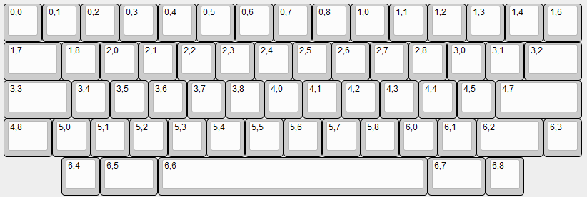
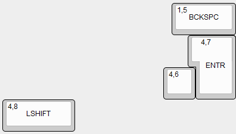

# ZMK for Unix60
Unix60 is a HHKB clone developed by mkdl. You can find its repo [here](https://github.com/mkdl/Unix60).
## Current state
- compiles without any issues :)
- every key works :))
- broken keymap
- no idea about bluetooth
- left shift does not work with keys on the same matrix row (j, k, l, ;, ', and enter)
## Layout
I'm using following layout that I mapped in the .overlay file.  
 
If you wish to use different layout, you'll have to edit both overaly and keymap. The matrix numbers of alternative keys are probably as follows, but I have not tested that.   

## Keymap
My keymap is aimed to be as close to HHKB as possible. I added one extra key to the right of LSHIFT. Reason being my default language have terrible support for symbols used in programming, so I'm hoping to experiment with this and add a layer for characters such as <> and [] etc.